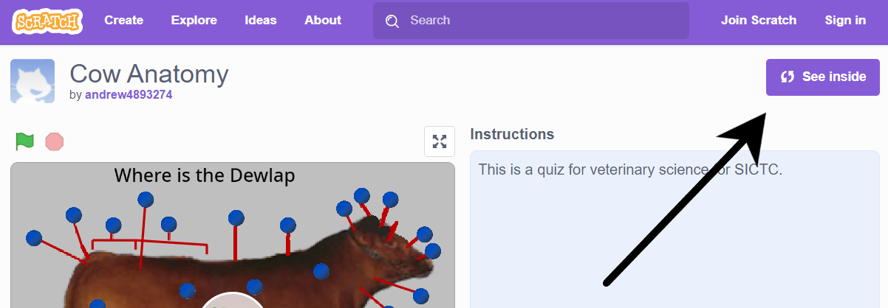
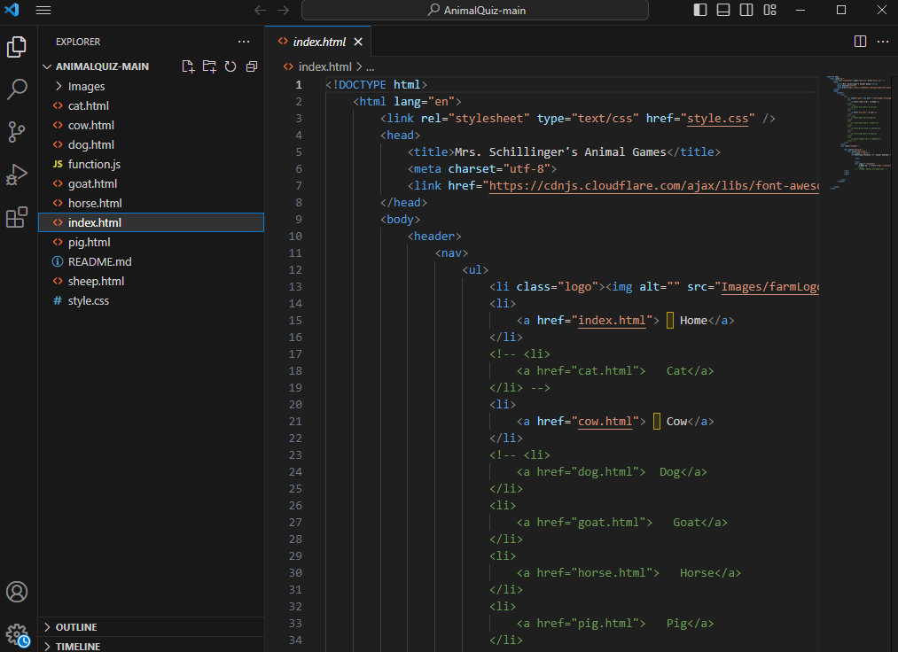

# ExtAniAnat
External Animal Anatomy Quiz Game


# How to add more Animals
This quiz was made using scratch. All of the core mechanics of the game are all built out and ready to be copy and pasted to the other animals.

**Step 1, Joining Scrach** <br>
- Go to Scratch.com
- Click "Join Scratch" and create an account
- Then, click this link to go to the [Scratch Project](https://scratch.mit.edu/projects/885605066)
- <a href="https://scratch.mit.edu/projects/885605066" target="_blank">Hello, world!</a>
- Click the "See inside button" on the project page.<br>

- If you are signed into your account, there should be a remix button on the top of the page, click that to make a copy.<br>

- Congradulations! You made a copy of the project and are ready to start making your animal.

  
**Step 2, Setting up the Project** <br>
- Open the remix file under the "My Stuff" section in your account.
- Now that you are inside the file, look to the right side of the screen where it says "sprites"
- There are going to be many sprites, but the main sprite you are going to be messing with is called "Question"
- The "Question" sprite contains about 90% of the code for the game, you will not need to mess with the code for the other sprites. <br>


- If you are on this page, you are caught up
- Look to the right, there will be an button with a image icon, click it and change the backdrop to the image of the animal you want.
- The buttons on the screen are draggable. Move them to the location of where your new animal's body parts are.
- If there are extras, delete the button sprite from the list below.
- If you need more buttons, right click a sprite from the list and you should be given the option to duplicate it. (click the sprite from the list and change the global costume picker variable to a new one not already taken by another sprite.
- Now, here is the time consuming part, You will need to go to the sprites list and change all the old names to the new names of the animal parts of your new animal.
- Then, click on the "Question" sprite, to the left of your screen, there will be a costumes tab, click it.
- Change the text on each costume to the sprite names you chose, this will make the game ask the user the question of which sprite to click on.


**Step 3, Changing the Code** <br>
- Luckly for you, if you get confused with what the code does, I commented almost all of the code to tell you what it does. Before you change anything, I would recommend that you read my comments first.
- Most of this code does NOT need to be touched, the only code you need to mess with is code that uses the variables: Points, Global CostumePicker, and Random Number.
- Look at the amount of sprites you have, change "random number to pick a number between 1 and (the amount of sprites you have).<br>
  
- Change the variable "Points" to the amount of sprites you have.<br>
  
- This is an example of what one of the "points" blocks look like, there are a lot of these in the code so make sure to change all of them.
- The leaderboard blocks should not need to be touched.
- That should be it with the code you need to change, if you are still having issues, the code is labeled and should be easy to troubleshoot. If you are still having problems, ask Bander for help or he can ask me to help.
- This should be it for coding.


**Step 4, Updating the Website** <br>
-The way that the vet students access this game is through a website we made, the scratch project is embeded into html through an iframe tag. If that sounds like a lot, don't worry, its just a lot of copying and pasting.
- Go to this github [Repo](https://github.com/SICTCCS/AnimalQuiz), this is where the website is being hosted.
- Click the green "Code" button then you should have the option to download the website code as a zip file.
- extract it and open the folder in a IED (VS Code, Replit, Ect.)


- These should be the files you are seeing.
- There should be a file for your animal, it may sound weird but the only updated files are the cow.html and index.html so for you animal, delete everything in that file.
- Go to cow.html and press (ctrl + a) and copy and paste it into your animal's file. This is the updated template.
- Now that you copied the code over to your file, you will see a "iframe" tag.
  ```
  <iframe src="https://scratch.mit.edu/projects/embed/885605066/" allowtransparency="true" width="485" height="402" frameborder="0" scrolling="no" allowfullscreen></iframe>
  ```
- Remove the link from inside the iframe, and replace it with the link from your new animal. (Tip: In your link, put the word "embedded" after projects, your link will not work otherwise, look at the image above for reference.)
- In each of the files, uncomment your animal's file name from the class "nav", this way it will show up on the navagation bar when you view the website.

- This is what your animal's webpage should look like when its done.
- Thats all you need to do with the website code!
- Go back to the github repo and press the "add files" button. Upload the whole folder to the repo and you should have the option to merge it with the old files. If that doesnt work, just add the new files and go in to delete the old ones manually. (If you do not have the option to upload files, that means your account does not have permission to upload to the repo, ask Bander to make you an editor).
- Thats it! Thanks for helping me finish these games.
- If you have any questions, ask Bander or contact me through my [Website](https://andrewscheller2006.github.io/Portfolio/contact.html).
